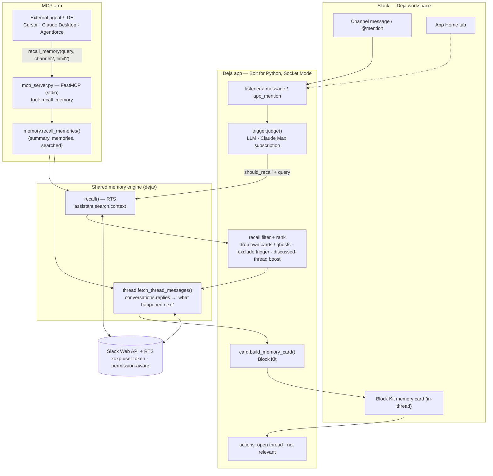

# Déjà — Architecture

Déjà is a Slack agent that surfaces the concrete past thread a team already had on a decision, so
nobody re-litigates what was already discussed and decided. Its memory is exposed **two ways** —
inside Slack as an auto-triggered Block Kit card, and to any external agent as an **MCP tool** — and
both share one engine built on the two required technologies: **Real-Time Search (RTS)** and **MCP**.

## Flow

## Components

| Component | File | Role |
|---|---|---|
| **Listeners** | `listeners/events/*` | Receive Slack events. Auto-trigger on channel messages (silent unless a memory is found); `@mention` is an explicit trigger. Excludes the triggering message itself. |
| **Trigger judge** | `deja/trigger.py` | LLM gate (Claude Agent SDK on the **Max subscription** — no API key). Decides whether a message is a decision/claim/proposal worth recalling and produces a concise search query. Small talk → silent. |
| **Recall (RTS)** | `deja/recall.py` | **Required tech #1.** Calls Slack **Real-Time Search** (`assistant.search.context`) with the user token, so results are **permission-aware** (only channels the user can see). RTS returns no score, so Déjà scores by query-overlap and ranks deterministically; it also drops its own cards, empty/ghost (deleted-but-still-indexed) hits, and the triggering message, and boosts threads that were actually discussed. |
| **Enrichment** | `deja/thread.py` | Pulls `conversations.replies` to extract *what happened next* — the decision/rollback. Resolves reply-level hits to their thread root so those enrich too. Detects deleted (tombstone) parents. |
| **Card** | `deja/card.py` | Block Kit memory card: header · searched query · found message (channel/author/date + quote) · **what happened next** · actions (open thread / not relevant) · a permission-aware privacy line. |
| **Actions** | `listeners/actions/deja_card.py` | `open thread` (URL button, ack-only) and `not relevant` (collapse the card + log a precision signal). |
| **App Home** | `listeners/views/app_home_builder.py` | What Déjà is, how it works, and the privacy promise. |
| **MCP server** | `deja/mcp_server.py` | **Required tech #2.** A **FastMCP** server (stdio; `streamable-http` for remote) exposing the `recall_memory` tool so Cursor / Claude Desktop / Agentforce can query the team's memory. |
| **Memory (MCP logic)** | `deja/memory.py` | Reuses `recall()` + enrichment and returns structured `{summary, memories[], searched}`. No LLM here — the calling agent is the LLM. Never raises; empty/error → `memories: []` + a summary. |

## Two required technologies

- **RTS recall** — `deja/recall.py` → `assistant.search.context`, permission-aware, on the user token.
- **MCP** — `deja/mcp_server.py` → `recall_memory`, verified end-to-end by a real stdio client
  (`scripts/mcp_smoke.py`).

Both arms funnel through the same `recall()` + `fetch_thread_messages()` engine, so a fix or an
improvement lands in Slack and in every external agent at once — that is the composability story.

## Auth & privacy

- **LLM:** Claude **Max subscription** via `CLAUDE_CODE_OAUTH_TOKEN` (Claude Agent SDK) — no paid API key.
- **Slack search:** the user's RTS token (`SLACK_USER_TOKEN`, `xoxp-…`), so Déjà only ever sees
  channels that user can already access. In production this would be per-user OAuth; the sandbox uses
  a single user token. Secrets live only in `.env` (git-ignored).
