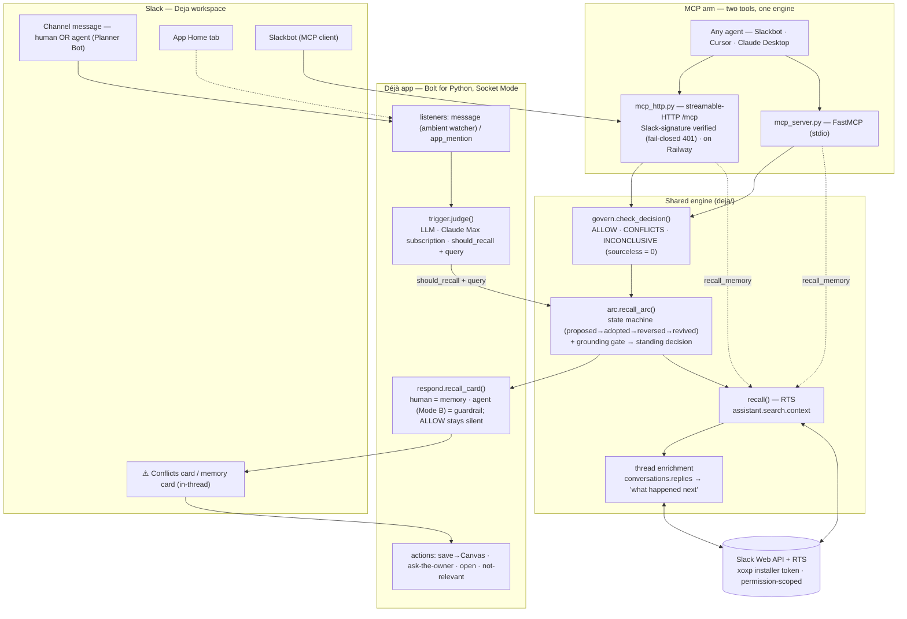

# Déjà — Architecture

Déjà is the **decision-governance layer** for a Slack workspace: it reads the team's standing
decisions out of their own history and, when a proposal conflicts with one, drops a **sourced**
guardrail. The same engine has **two consumers** — an **ambient watcher** (Déjà reads every message,
human *and* agent, and brakes conflicts) and an **MCP** contract (any agent, including Slackbot, calls
`check_decision`/`recall_memory`). Both are built on the two required technologies: **Real-Time Search
(RTS)** and **MCP**. Verdicts are sourced or they are not made — a fabricated brake is worse than none.

## Flow



## Components

| Component | File | Role |
|---|---|---|
| **Ambient watcher** | `listeners/events/message.py` | Reads **every** channel message — human and agent — and checks it against standing decisions. Loop-safe: never reacts to its own output, never answers a message addressed to Déjà, posts **at most once per thread** (atomic claim), and **never brakes Slackbot** (sponsor-safety). ALLOW is silent — only CONFLICTS/INCONCLUSIVE reach the channel. |
| **Trigger judge** | `deja/trigger.py` | LLM gate (Claude Agent SDK on the **Max subscription** — no paid API key). Decides whether a message is a decision/proposal worth checking and emits a concise query. The **same `should_recall` gate applies to both consumers** — the agent path is never more permissive than the human one (chit-chat with a decision keyword stays silent). |
| **Recall (RTS)** | `deja/recall.py` | **Required tech #1.** `assistant.search.context` on the installer's user token. RTS returns no score, so Déjà ranks by distinctive-term overlap, drops its own cards / ghosts / the triggering message, and boosts genuinely-discussed threads. |
| **Decision arc** | `deja/arc.py` | Stitches recalled threads into a timeline via a state machine (proposed → adopted → reversed → revived); the **standing decision** is derived from the last state-changing thread. The **grounding gate** admits a decision only when a distinctive *subject* word of the query appears in the retrieved threads (a shared verb like *migrate*/*buy* is not a topic match). |
| **Governance verdict** | `deja/govern.py` | `check_decision(proposal)` → `ALLOW / CONFLICTS / INCONCLUSIVE`. Runs the same judge → arc path, then the conflict test (does the proposal re-open the *rejected* side, not the kept one?). **Sourceless verdict = 0:** a CONFLICTS it can't link downgrades to INCONCLUSIVE. |
| **Enrichment** | `deja/thread.py` | `conversations.replies` → *what happened next* (the decision/rollback); resolves reply hits to their thread root; detects deleted parents. |
| **Card / response** | `deja/card.py`, `deja/respond.py` | Block Kit: standing decision as hero, clickable timeline, owner, N×, sources. `agent_conflict` reframes the header as a **⚠️ guardrail** for Mode B. |
| **Actions** | `listeners/actions/deja_card.py` | 💾 Save decision → team Canvas + App Home, 🗣️ Ask the decision owner (nudges the owner in-thread), 🔗 open source, 🙅 not relevant. |
| **App Home** | `listeners/views/app_home_builder.py` | Re-litigation metric ("N decisions keep coming back"), recent decisions (each linking to its thread), Try-these. |
| **MCP server** | `deja/mcp_server.py` (stdio) · `deja/mcp_http.py` (HTTP) | **Required tech #2.** Both publish **two** tools — `recall_memory` (lookup) and `check_decision` (governance verdict). The HTTP server (the one Slackbot reaches) is **Slack-signature verified, fail-closed** (unsigned → 401) and runs on Railway. |
| **Planner Bot** | `planner_bot/` | A standalone demo agent with no awareness of Déjà — it posts proposals; Déjà (ambient) catches the conflicting one, stays silent on the aligned one, and refuses to invent a verdict on the undecided one. |

## Two required technologies

- **RTS recall** — `deja/recall.py` → `assistant.search.context`, permission-scoped, on the installer token.
- **MCP** — **two tools** (`recall_memory` + `check_decision`), served over stdio (`mcp_server.py`,
  verified by `scripts/mcp_smoke.py`) and HTTP (`mcp_http.py`, verified live by **Slackbot** calling
  both — see [`SLACKBOT-MCP.md`](SLACKBOT-MCP.md)). Plus agent-to-agent governance and ambient agent
  watching on top.

Both consumers funnel through the same `judge → recall_arc → govern` engine, so a fix lands in the
channel and in every external agent at once.

## Deploy, auth & privacy

- **Hosting:** one Railway service runs the Socket-Mode agent + the MCP HTTP server in one event loop
  (`railway_start.py`, bound to `$PORT`); a crash restarts both together. Requires **`IS_SANDBOX=1`**
  (the judge's CLI refuses `--dangerously-skip-permissions` as root). See [`DEPLOY.md`](DEPLOY.md).
- **LLM:** Claude **Max subscription** via `CLAUDE_CODE_OAUTH_TOKEN` (Claude Agent SDK) — no paid API key.
- **Slack search:** the **installer's** RTS token (`SLACK_USER_TOKEN`, `xoxp-…`), so Déjà only ever
  reaches channels **that account** can access — scoped to one real user's permissions, not per-caller
  (per-viewer scoping would need per-user OAuth; documented, not shipped). The `/mcp` endpoint verifies
  Slack's request signature and is fail-closed. Secrets live only in `.env` (git-ignored, never committed).
```
